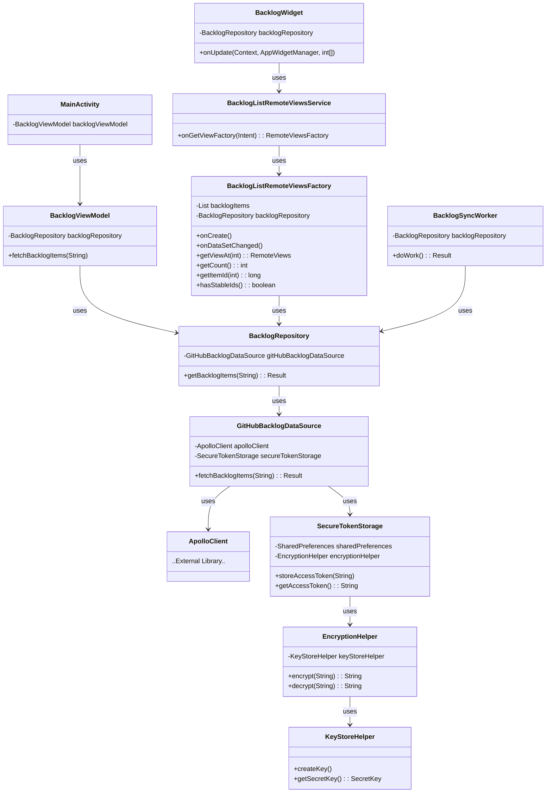

# Backlog Editor

## Design

```mermaid
classDiagram
    class MainActivity {
        -BacklogViewModel backlogViewModel
    }
    class BacklogViewModel {
        -BacklogRepository backlogRepository
        +fetchBacklogItems(String)
    }
    class BacklogRepository {
        -GitHubBacklogDataSource gitHubBacklogDataSource
        +getBacklogItems(String): Result
    }
    class GitHubBacklogDataSource {
        -ApolloClient apolloClient
        -SecureTokenStorage secureTokenStorage
        +fetchBacklogItems(String): Result
    }
    class ApolloClient {
        ..External Library..
    }
    class KeyStoreHelper {
        +createKey()
        +getSecretKey(): SecretKey
    }
    class EncryptionHelper {
        -KeyStoreHelper keyStoreHelper
        +encrypt(String): String
        +decrypt(String): String
    }
    class SecureTokenStorage {
        -SharedPreferences sharedPreferences
        -EncryptionHelper encryptionHelper
        +storeAccessToken(String)
        +getAccessToken(): String
    }
    class BacklogWidget {
        -BacklogRepository backlogRepository
        +onUpdate(Context, AppWidgetManager, int[])
    }
    class BacklogListRemoteViewsService {
        +onGetViewFactory(Intent): RemoteViewsFactory
    }
    class BacklogListRemoteViewsFactory {
        -List backlogItems
        -BacklogRepository backlogRepository
        +onCreate()
        +onDataSetChanged()
        +getViewAt(int): RemoteViews
        +getCount(): int
        +getItemId(int): long
        +hasStableIds(): boolean
    }
    class BacklogSyncWorker {
        -BacklogRepository backlogRepository
        +doWork(): Result
    }

    MainActivity --> BacklogViewModel : uses
    BacklogViewModel --> BacklogRepository : uses
    BacklogRepository --> GitHubBacklogDataSource : uses
    GitHubBacklogDataSource --> ApolloClient : uses
    GitHubBacklogDataSource --> SecureTokenStorage : uses
    SecureTokenStorage --> EncryptionHelper : uses
    EncryptionHelper --> KeyStoreHelper : uses
    BacklogWidget --> BacklogListRemoteViewsService : uses
    BacklogListRemoteViewsService --> BacklogListRemoteViewsFactory : uses
    BacklogListRemoteViewsFactory --> BacklogRepository : uses
    BacklogSyncWorker --> BacklogRepository : uses

```
